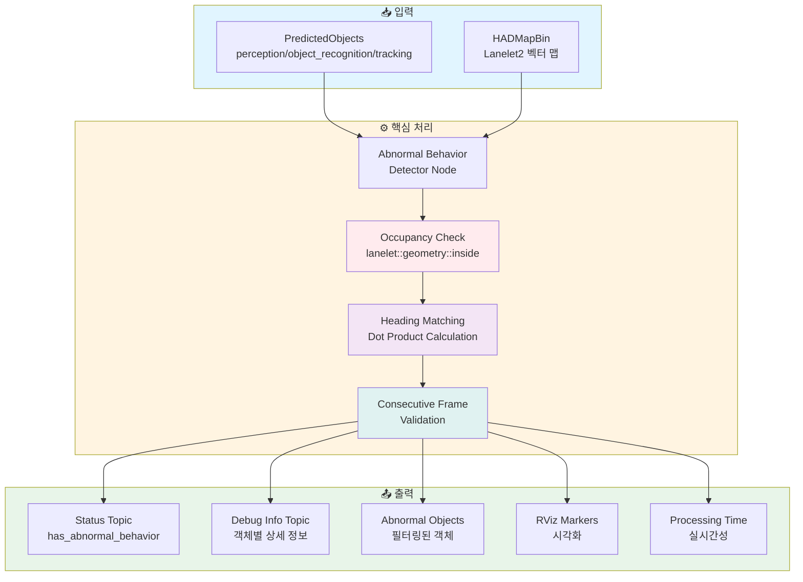
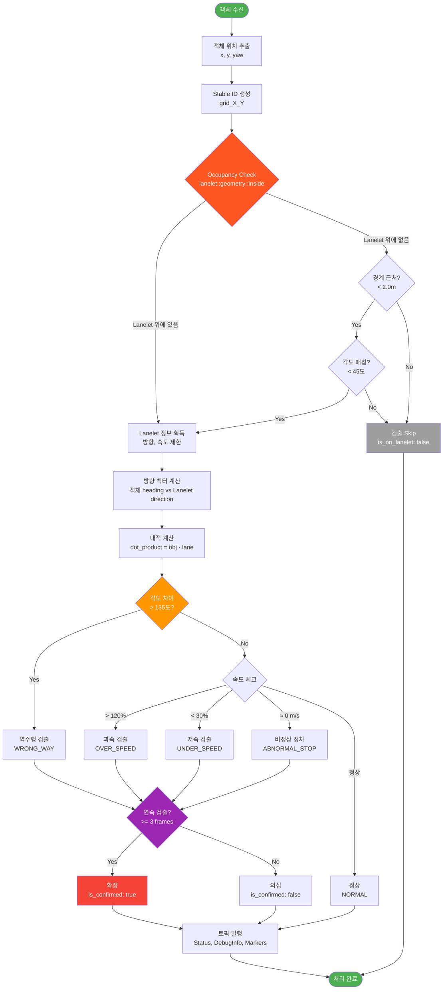
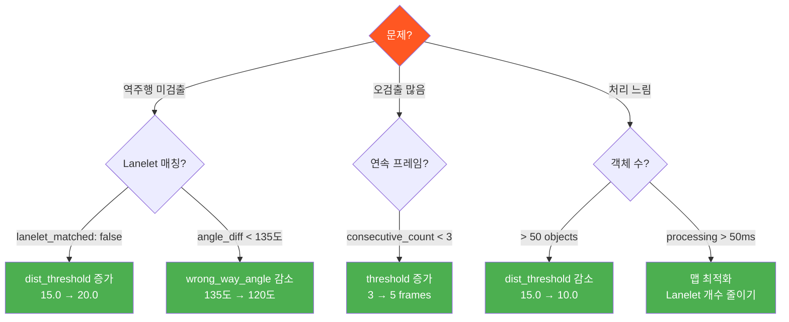

# Abnormal Behavior Detector

[](https://docs.ros.org/en/humble/)
[](https://opensource.org/licenses/Apache-2.0)
[](https://github.com/autowarefoundation/autoware.universe)

원형 교차로(Roundabout)에서 **이상 거동**을 실시간으로 검출하는 ROS 2 패키지입니다.

## 📋 목차

- [개요](#-개요)
- [주요 기능](#-주요-기능)
- [시스템 아키텍처](#-시스템-아키텍처)
- [검출 알고리즘](#-검출-알고리즘)
- [토픽 인터페이스](#-토픽-인터페이스)
- [사용 방법](#-사용-방법)
- [파라미터 튜닝](#-파라미터-튜닝)
- [문제 해결](#-문제-해결)

---

## 🎯 개요

### 프로젝트 배경

- **환경**: 고정식 센서 (기둥 위 LiDAR) 기반 모니터링
- **목적**: 원형 교차로에서 위험한 이상 거동을 실시간 검출
- **특징**: 자차(Ego Vehicle) 없이 고정 센서만으로 동작

### 검출 대상

| 이상 거동 | 설명 | 신뢰도 |
|----------|------|--------|
| 🔴 **역주행** (Wrong-way) | Lanelet 방향과 반대로 주행 | 95% |
| 🟠 **과속** (Over-speed) | 제한 속도 초과 (기본: 120%) | 70% |
| 🟡 **저속** (Under-speed) | 제한 속도 미달 (기본: 30%) | 60% |
| 🟢 **비정상 정차** (Abnormal Stop) | 신호등/정지선 외 정차 | 80% |

---

## 🚀 주요 기능

### ✅ v1.6 핵심 개선사항

1. **Occupancy 기반 Lanelet 매칭**
   - ✅ Lanelet 위에 있는 객체만 검출
   - ✅ 강제 매칭 방지 → 보행자 오검출 해결
   - ✅ 클래스 무관 검출 (차량, 보행자, 자전거 모두)

2. **위치 기반 안정적 추적**
   - ✅ Grid 기반 Stable ID (3.0m 단위)
   - ✅ UUID 변경에도 안정적 추적
   - ✅ 연속 프레임 카운트 정확도 향상

3. **토픽 기반 모니터링**
   - ✅ Status 토픽: 이상 거동 여부 (bool)
   - ✅ Debug Info 토픽: 객체별 상세 정보
   - ✅ Processing Time 토픽: 실시간성 모니터링
   - ✅ 로그 대폭 감소 (이상 시에만 출력)

---

## 🏗️ 시스템 아키텍처



---

## 🔍 검출 알고리즘

### 전체 워크플로우



### 1️⃣ Occupancy 기반 Lanelet 매칭 (v1.6)

**핵심 로직** (`abnormal_behavior_detector_node.cpp:512`):

```cpp
boost::optional<lanelet::ConstLanelet> findClosestLanelet(const PredictedObject & object)
{
  lanelet::BasicPoint2d search_point(pos.x, pos.y);

  // 1단계: 객체가 Lanelet 안에 있는지 확인 (Occupancy)
  for (const auto & lanelet : lanelet_map_ptr_->laneletLayer) {
    if (lanelet::geometry::inside(lanelet, search_point)) {
      return lanelet;  // ✅ Lanelet 위에 있음
    }
  }

  // 2단계: 경계 근처 (< 2.0m) + 각도 매칭
  const auto nearby = lanelet::geometry::findNearest(..., 5);
  for (const auto & [dist, lanelet] : nearby) {
    if (dist > 2.0) continue;  // 2m 이내만
    if (angle < 45°) return lanelet;  // 각도 일치
  }

  return boost::none;  // ❌ 매칭 실패
}
```

**결과**:
- ✅ Lanelet 위의 객체만 검출
- ✅ 보행자 오검출 방지
- ✅ 클래스 무관 (차량, 보행자, 자전거 모두)

### 2️⃣ Heading 기반 역주행 검출

**내적 계산** (`abnormal_behavior_detector_node.cpp:712`):

```cpp
// 객체 heading 단위 벡터
Eigen::Vector2d obj_heading(cos(yaw), sin(yaw));

// Lanelet 방향 단위 벡터
Eigen::Vector2d lane_direction = ...;

// 내적 계산
double dot_product = obj_heading.dot(lane_direction);
double angle = acos(dot_product) * 180.0 / M_PI;

// 역주행 판단
if (angle > 135°) {
  // ⚠️ 역주행 의심
}
```

**임계값**:
- `wrong_way_angle_threshold: 2.356 rad` (135도)
- Dot product < -0.707 → 역주행

### 3️⃣ 연속 프레임 검증

```cpp
// 3프레임 이상 연속 검출 시 확정
if (object_history.consecutive_count >= 3) {
  debug_info.is_confirmed = true;  // ✅ 확정
}
```

---

## 📡 토픽 인터페이스

### 입력 토픽

| 토픽 | 타입 | 설명 |
|------|------|------|
| `/perception/object_recognition/tracking/objects` | `PredictedObjects` | 추적된 객체 |
| `/map/vector_map` | `HADMapBin` | Lanelet2 맵 |

### 출력 토픽

#### ⭐ 1. `/abnormal_behavior/output/status` (가장 중요)

**타입**: `abnormal_behavior_detector/msg/AbnormalBehaviorStatus`

```yaml
has_abnormal_behavior: true          # ← 이상 거동 여부 (bool)
total_objects: 5
abnormal_objects_count: 1
wrong_way_count: 1                   # 역주행 차량 수
over_speed_count: 0
under_speed_count: 0
abnormal_stop_count: 0
processing_time_ms: 2.35             # 처리 시간 (ms)
```

**사용 예시**:
```bash
# 실시간 모니터링
ros2 topic echo /abnormal_behavior/output/status

# 이상 거동 여부만 확인
ros2 topic echo /abnormal_behavior/output/status --field has_abnormal_behavior
```

#### 🔍 2. `/abnormal_behavior/output/debug_info` (상세 디버그)

**타입**: `abnormal_behavior_detector/msg/ObjectDebugInfo`

```yaml
stable_object_id: "grid_3872_30304"  # 위치 기반 stable ID
uuid: "94d9e9c2"                      # 원본 UUID
position: {x: 11615.82, y: 90913.39}
yaw_deg: 179.8

lanelet_matched: true
is_on_lanelet: true                   # ✅ Occupancy 결과 (v1.6)
matched_lanelet_id: 686
lanelet_distance: 4.10

object_heading_vector: {x: -1.0, y: 0.003}
lanelet_direction_vector: {x: 1.0, y: 0.011}
dot_product: -1.000                   # 내적 값
angle_diff_deg: 179.7                 # 각도 차이

behavior_type: "WRONG_WAY"
confidence: 0.95
consecutive_count: 3
is_confirmed: true                    # ✅ 확정

speed_ms: 0.0
speed_kmh: 0.0
speed_limit_kmh: 60.0
```

#### ⏱️ 3. `/abnormal_behavior/debug/processing_time_ms`

**타입**: `tier4_debug_msgs/msg/Float64Stamped`

```bash
# 처리 시간 모니터링
ros2 topic echo /abnormal_behavior/debug/processing_time_ms

# 출력:
data: 2.35  # ✅ < 10 ms → 실시간성 우수
```

**기준**:
- ✅ < 10 ms: 매우 우수
- ✅ < 50 ms: 우수 (20 Hz)
- ⚠️ < 100 ms: 양호 (10 Hz)
- ❌ > 100 ms: 개선 필요

#### 4. `/abnormal_behavior/output/abnormal_objects`

**타입**: `autoware_auto_perception_msgs/msg/PredictedObjects`

이상 거동 객체만 필터링된 리스트

#### 5. `/abnormal_behavior/debug/markers`

**타입**: `visualization_msgs/msg/MarkerArray`

RViz2 시각화 마커 (빨간 원, 텍스트)

---

## 🛠️ 사용 방법

### 1. 빌드

```bash
cd ~/autoware
colcon build --packages-select abnormal_behavior_detector
source install/setup.bash
```

### 2. Planning Simulator에서 실행

```bash
# Terminal 1: Planning Simulator
ros2 launch autoware_launch planning_simulator.launch.xml \
  map_path:=/path/to/your/map \
  vehicle_model:=sample_vehicle \
  sensor_model:=sample_sensor_kit

# Terminal 2: Abnormal Behavior Detector
ros2 launch abnormal_behavior_detector abnormal_behavior_detector.launch.xml
```

### 3. 2D Pose Estimate 설정

**중요**: Goal은 찍을 필요 없음 (고정 센서 모드)

1. RViz2에서 `2D Pose Estimate` 클릭
2. 센서 위치(기둥)에 위치 설정
3. ✅ Goal 불필요 (Planning 미사용)

### 4. 모니터링

```bash
# Terminal 3: Status 확인
ros2 topic echo /abnormal_behavior/output/status

# Terminal 4: 상세 디버그 (필요 시)
ros2 topic echo /abnormal_behavior/output/debug_info

# Terminal 5: 처리 시간
ros2 topic echo /abnormal_behavior/debug/processing_time_ms
```

### 5. RViz2 시각화

**MarkerArray 추가**:
1. Add → MarkerArray
2. Topic: `/abnormal_behavior/debug/markers`
3. ✅ 역주행 차량 위에 빨간 원과 텍스트 표시

---

## ⚙️ 파라미터 튜닝

### 주요 파라미터 (`config/abnormal_behavior_detector.param.yaml`)

```yaml
/**:
  ros__parameters:
    # Lanelet 매칭
    dist_threshold_for_searching_lanelet: 15.0       # 검색 거리 (m)
    delta_yaw_threshold_for_searching_lanelet: 0.785 # 각도 임계값 (45도)

    # 역주행 검출
    wrong_way_angle_threshold: 2.356                 # 135도 (라디안)
    consecutive_count_threshold: 3                   # 연속 프레임 수

    # 속도 검출
    speed_threshold_ratio: 1.2                       # 과속: 120%
    min_speed_threshold: 0.5                         # 정차: < 0.5 m/s

    # 추적
    use_position_based_tracking: true
    position_based_id_grid_size: 3.0                 # Grid 크기 (m)
    history_buffer_size: 10
    history_timeout: 3.0                             # 초
```

### 튜닝 가이드



---

## 🐛 문제 해결

### Q1: 역주행이 검출되지 않아요

**Step 1**: Status 확인
```bash
ros2 topic echo /abnormal_behavior/output/status
```
- `total_objects: 0` → Perception 문제
- `total_objects: 3`, `wrong_way_count: 0` → 검출 로직 문제

**Step 2**: Debug Info 확인
```bash
ros2 topic echo /abnormal_behavior/output/debug_info
```

확인 사항:
- `lanelet_matched: false` → Lanelet 매칭 실패
  - **해결**: `dist_threshold_for_searching_lanelet` 증가 (15.0 → 20.0)

- `is_on_lanelet: false` → Occupancy 실패 (Lanelet 위에 없음)
  - **해결**: 객체가 실제로 Lanelet 위에 있는지 확인

- `angle_diff_deg: 80` → 각도가 임계값(135도) 미달
  - **해결**: `wrong_way_angle_threshold` 감소 (2.356 → 2.094 = 120도)

**Step 3**: 벡터 확인
```bash
ros2 topic echo /abnormal_behavior/output/debug_info --field dot_product
```
- `dot_product: 0.5` → 60도 차이 (정상)
- `dot_product: -0.5` → 120도 차이 (역주행 의심)
- `dot_product: -1.0` → 180도 차이 (명확한 역주행)

### Q2: 보행자가 오검출되어요

**원인**: v1.5 이전 버전 (강제 매칭)

**해결**: v1.6으로 업데이트
```bash
cd ~/autoware
git pull origin release/v1.0
colcon build --packages-select abnormal_behavior_detector
```

**확인**:
```bash
ros2 topic echo /abnormal_behavior/output/debug_info --field is_on_lanelet
```
- `is_on_lanelet: false` → 검출 안 함 ✅
- `is_on_lanelet: true` → 검출함 (Lanelet 위에 있음)

### Q3: 처리 시간이 너무 높아요 (> 50ms)

**원인**:
- 객체 수가 많음
- Lanelet 검색이 느림

**해결**:

1. **파라미터 조정**:
   ```yaml
   dist_threshold_for_searching_lanelet: 10.0  # 15.0에서 감소
   ```

2. **맵 최적화**:
   - Lanelet 개수 줄이기
   - 불필요한 Lanelet 제거

3. **확인**:
   ```bash
   ros2 topic echo /abnormal_behavior/debug/processing_time_ms
   ```

### Q4: 같은 객체인데 ID가 계속 바뀌어요

**원인**: Tracking에서 UUID가 매 프레임 변경됨

**해결**: 위치 기반 Stable ID 사용 (v1.4+)
```yaml
use_position_based_tracking: true
position_based_id_grid_size: 3.0  # 3m 단위 grid
```

**확인**:
```bash
ros2 topic echo /abnormal_behavior/output/debug_info --field stable_object_id
```
- `grid_3872_30304` → 위치 기반 ID ✅

### Q5: 토픽이 안 보여요

```bash
# 토픽 리스트 확인
ros2 topic list | grep abnormal_behavior

# 노드 확인
ros2 node list | grep abnormal_behavior

# 노드 정보
ros2 node info /abnormal_behavior_detector
```

---

## 📊 메시지 타입 정의

### AbnormalBehaviorStatus.msg

```
std_msgs/Header header
bool has_abnormal_behavior           # 이상 거동 여부
uint32 total_objects                 # 전체 객체 수
uint32 abnormal_objects_count        # 이상 객체 수
uint32 wrong_way_count               # 역주행 수
uint32 over_speed_count              # 과속 수
uint32 under_speed_count             # 저속 수
uint32 abnormal_stop_count           # 비정상 정차 수
float64 processing_time_ms           # 처리 시간 (ms)
```

### ObjectDebugInfo.msg

```
std_msgs/Header header

# 객체 기본 정보
string stable_object_id              # 위치 기반 stable ID
string uuid                          # 원본 UUID
geometry_msgs/Point position         # 위치
float64 yaw_rad                      # Yaw (라디안)
float64 yaw_deg                      # Yaw (도)

# Lanelet 매칭 정보
bool lanelet_matched                 # Lanelet 매칭 성공 여부
bool is_on_lanelet                   # Occupancy 결과 (v1.6)
int64 matched_lanelet_id             # 매칭된 Lanelet ID
float64 lanelet_distance             # Lanelet까지 거리 (m)
uint32 nearby_lanelets_count         # 주변 Lanelet 개수

# 방향 벡터 정보
geometry_msgs/Vector3 object_heading_vector      # 객체 heading
geometry_msgs/Vector3 lanelet_direction_vector   # Lanelet 방향
float64 dot_product                  # 내적 값
float64 angle_diff_deg               # 각도 차이 (도)
float64 wrong_way_threshold_deg      # 역주행 임계값 (도)

# 검출 결과
string behavior_type                 # NORMAL/WRONG_WAY/OVER_SPEED/...
float64 confidence                   # 신뢰도
string description                   # 설명
int32 consecutive_count              # 연속 검출 횟수
bool is_confirmed                    # 확정 여부

# 속도 정보
float64 speed_ms                     # 속도 (m/s)
float64 speed_kmh                    # 속도 (km/h)
float64 speed_limit_ms               # 제한 속도 (m/s)
float64 speed_limit_kmh              # 제한 속도 (km/h)
```

---

## 📈 버전 히스토리

| 버전 | 날짜 | 주요 변경사항 |
|------|------|--------------|
| v1.0 | 2025-11-01 | 초기 구현 (속도 기반 검출) |
| v1.1 | 2025-11-01 | Heading 기반 검출로 변경 |
| v1.2 | 2025-11-02 | Lanelet 검색 거리 증가 (5m → 15m) |
| v1.3 | 2025-11-02 | 디버그 로그 추가 |
| v1.4 | 2025-11-02 | 위치 기반 Stable ID 구현 |
| v1.5 | 2025-11-03 | 토픽 기반 모니터링 시스템 |
| **v1.6** | **2025-11-03** | **Occupancy 기반 Lanelet 매칭** |

---

## 📝 라이선스

Apache License 2.0

---

## 💬 문의

**프로젝트**: 원형 교차로 이상 거동 검출 시스템
**개발 환경**: ROS 2 Humble, Autoware Universe
**센서**: 고정식 LiDAR (기둥 위) 및 시험차
